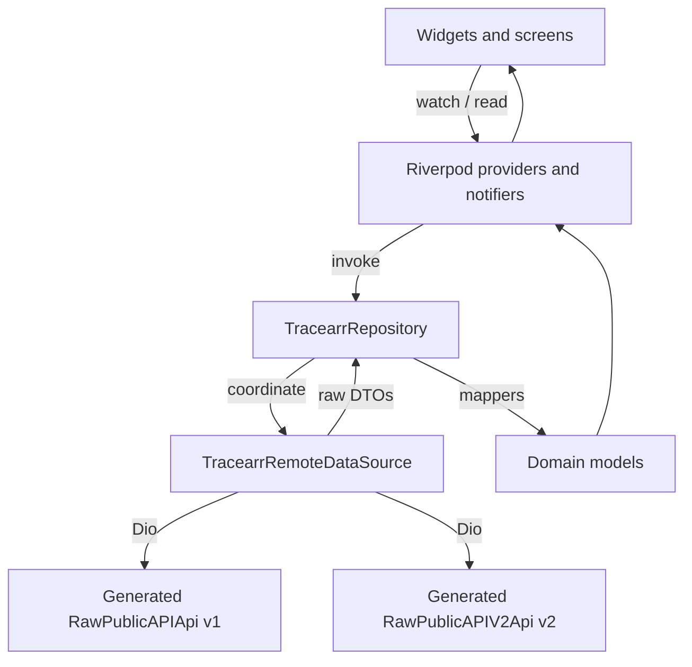

# Tracearr service notes (`service_tracearr`)

Tracearr monitors playback across a fleet of Plex, Jellyfin and Emby servers.
`service_tracearr` is Atrium's client for it, built strictly on Tracearr's
public v1 and v2 APIs.

## What is written down here, and what is not

These notes cover things you **cannot** learn by reading `lib/`: constraints
that live in Tracearr's server, and decisions whose reasoning would otherwise
be lost.

They deliberately do **not** contain a provider catalog, a file tree, a model
list or a route map. That kind of inventory duplicates the code, and it goes
stale silently: an out-of-date list is worse than no list, because the next
reader trusts it. For "what exists", read `lib/`; for "does it still behave
that way", read `test/`. The tests are the real defence against upstream
change, because they fail when Tracearr's payloads move. Prose does not.

- [Tracearr API v1 and v2](integration/tracearr-v1-v2.md): which generation
  serves which feature, and why both are still wired up.
- [Identifier reference](integration/identifiers.md): every id type in play,
  where it comes from, and what it is scoped to.
- [Media API boundaries](media/api-limitations.md): what the upstream schema
  does not give us, and what we do instead.

## Shape of the module

Tracearr-specific concerns stay inside this package: OpenAPI DTOs, rating-key
translation, image proxy URL construction. It talks to the rest of Atrium only
through `Instance`, provider families and `pushScreen()`.

## Contracts worth preserving

1. **v1 is not dead weight.** Six calls have no v2 equivalent at all: fleet
   health, 24h stats, activity trends, policy violations, stream termination.
   See the [v1 and v2 notes](integration/tracearr-v1-v2.md) before removing any
   of them.

2. **Section isolation.** Secondary telemetry (per-season episodes, dedicated
   history) runs inside its own `Consumer`, so one failing request degrades one
   box instead of blanking the screen. The per-season `Consumer` also keeps
   episode loading lazy: a collapsed season never mounts, so it never fetches.

3. **Contextual episode navigation.** Episode to series carries
   `initialSeasonNumber` and `initialEpisodeNumber` so the parent screen expands
   the right season and marks the originating episode.

4. **No request-per-tile.** Artwork is harvested from responses that already
   carry a thumb path and cached, rather than resolved with a lookup per card.
   Tracearr has no batch media endpoint, so a per-tile fetch would mean roughly
   30 round trips per page against a shared rate limit.

5. **Write actions are honest about being local.** Acknowledging or dismissing
   a violation is device-local, because those routes need session auth and are
   closed to public API tokens. The UI says so rather than implying it wrote
   back to the server.
