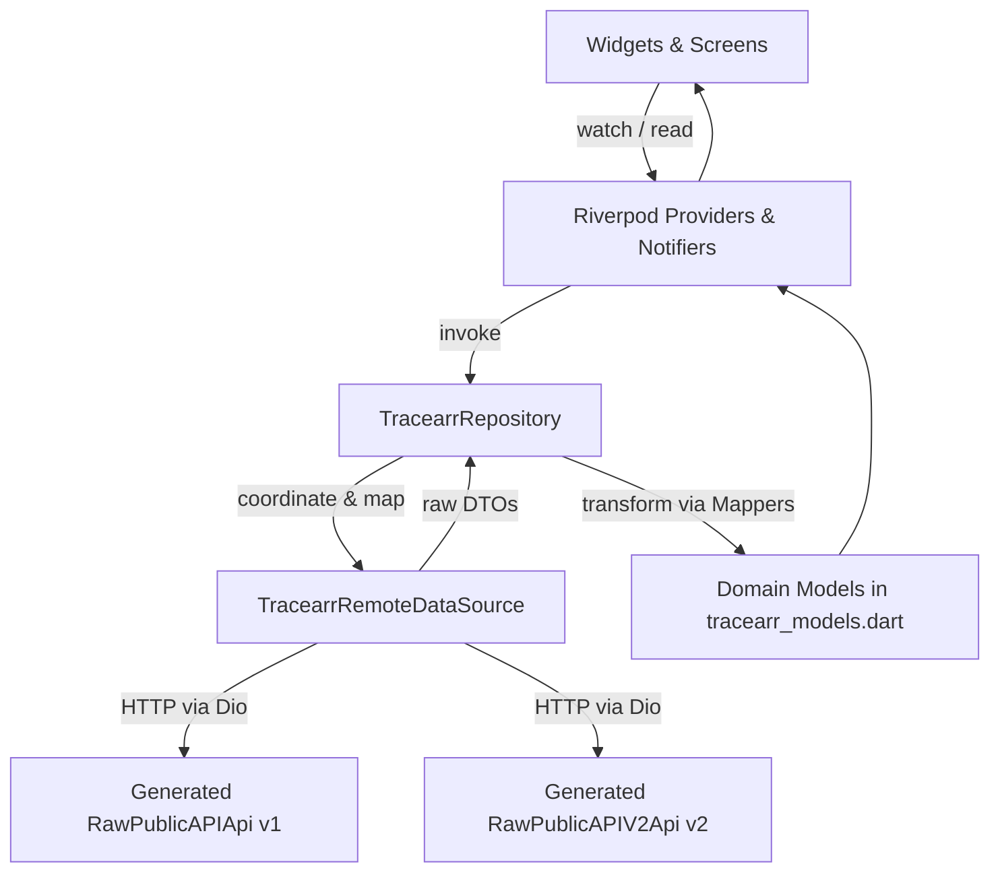

# Tracearr Service Documentation (`service_tracearr`)

Welcome to the canonical developer documentation for the **Tracearr Service** (`service_tracearr`) within Atrium.

Tracearr is a multi-server telemetry, media intelligence, and activity monitoring platform for media fleets (supporting Plex, Jellyfin, and Emby). `service_tracearr` integrates Tracearr instances into the unified Atrium Flutter client.

---

## 1. System Responsibilities & Boundaries

`service_tracearr` is responsible for:
- **Fleet Pulse & Health Monitoring**: Deriving real-time active stream counts, hardware vs. software transcode distribution, and 24-hour playback metrics across distributed servers.
- **Real-Time Stream & History Audit**: Visualizing active streaming sessions, transcode decisions, playback diagnostics, and chronological audit logs.
- **Media Catalog & Availability Intelligence**: Exposing physical file storage locations, resolutions (4K UHD vs. 1080p), TV series hierarchy (seasons and episodes), and direct media server launchers.
- **User Intelligence & Dossiers**: Tracking per-user watch times, favorite genres, top viewed media, and distinct device profiles.
- **Security & Incident Telemetry**: Managing concurrent stream policy violations, unusual IP locations, and security incidents.

### Service Boundaries
- **Encapsulation**: All Tracearr-specific OpenAPI serialization, multi-server rating key translation, image proxy URL construction, and telemetry normalization remain isolated inside `service_tracearr`.
- **Atrium Integration**: `service_tracearr` communicates with Atrium core through domain models (`Instance`, `ApiResponse`), Riverpod provider families, and `pushScreen()` routing conventions.

---

## 2. High-Level Architecture

The service follows a strict unidirectional data flow:

---

## 3. Documentation Index

### Core Architecture & Engineering
- [Architecture Overview](architecture.md): Service structure, dependency injection, data flow, and caching.
- [API Integration](api.md): v1 and v2 API surface, OpenAPI generation (`RawPublicAPIApi`, `RawPublicAPIV2Api`), and authentication.
- [Providers & State Management](providers.md): Complete Riverpod provider catalog, families, and notifiers.
- [Models & Serialization](models.md): Generated DTOs vs. Domain models and mapper transformations.
- [Navigation & Routing](navigation.md): Complete navigation map, route contracts, and contextual parameters.
- [Workflows](workflows.md): User-facing behavioral journeys and workflows.
- [Error Handling & Resilience](error-handling.md): Failures, retries, empty states, and section isolation.
- [Testing Guide](testing.md): Unit, widget, and provider test suites with verification commands.

### Feature Subsystems
- **Media Intelligence**:
  - [Media Architecture](media/architecture.md): Subsystem layout, components, and media type hierarchies.
  - [Media Navigation & TV Hierarchy](media/navigation.md): Context-aware Episode $\rightarrow$ Series transitions.
  - [Media Pagination](media/pagination.md): `EasyRefresh` infinite scrolling and cursor pagination.
  - [Media API Limitations](media/api-limitations.md): Downstream URL contracts and schema boundaries.
- **Activity & Telemetry**:
  - [Activity Architecture](activity/architecture.md): Active streams, history sessions, and transcode diagnostics.
- **User Directory**:
  - [Users Architecture](users/architecture.md): User directory, dossiers, and audience telemetry.
- **Overview & Fleet Pulse**:
  - [Overview Architecture](overview/architecture.md): Health, 24h trends, and aggregate metrics.
- **Integration Specifics**:
  - [v1 vs. v2 Coexistence Strategy](integration/tracearr-v1-v2.md): Why both versions exist and migration boundaries.
  - [Identifier Reference](integration/identifiers.md): Canonical media UUIDs, rating keys, machine IDs, and scopes.

---

## 4. Key Architectural Contracts to Preserve

1. **Do not casually delete v1 endpoints**: v1 endpoints expose low-level server rating keys, machine identifiers, and raw timestamps required for client-side artwork resolution that v2 abstracts away.
2. **Preserve Contextual Navigation**: Episode $\rightarrow$ Series navigation carries `initialSeasonNumber` and `initialEpisodeNumber` to auto-expand originating seasons and highlight active episodes.
3. **Respect Section Isolation**: Secondary telemetry (Dedicated History, TV hierarchy episodes) must run in isolated Riverpod `Consumer` boundaries so failure in one section does not blank the parent screen.

---

## 5. Source of Truth & Keeping Docs Updated

The Dart source code in `lib/`, OpenAPI specifications in `tool/`, and the automated test suite in `test/` serve as the **authoritative sources of truth** for `service_tracearr`.

These documentation files describe the current production architecture and user journeys. **Whenever a provider, domain model, navigation route, mapper, or API contract is modified, contributors must update the corresponding markdown documents in `docs/` as part of the same change.**
