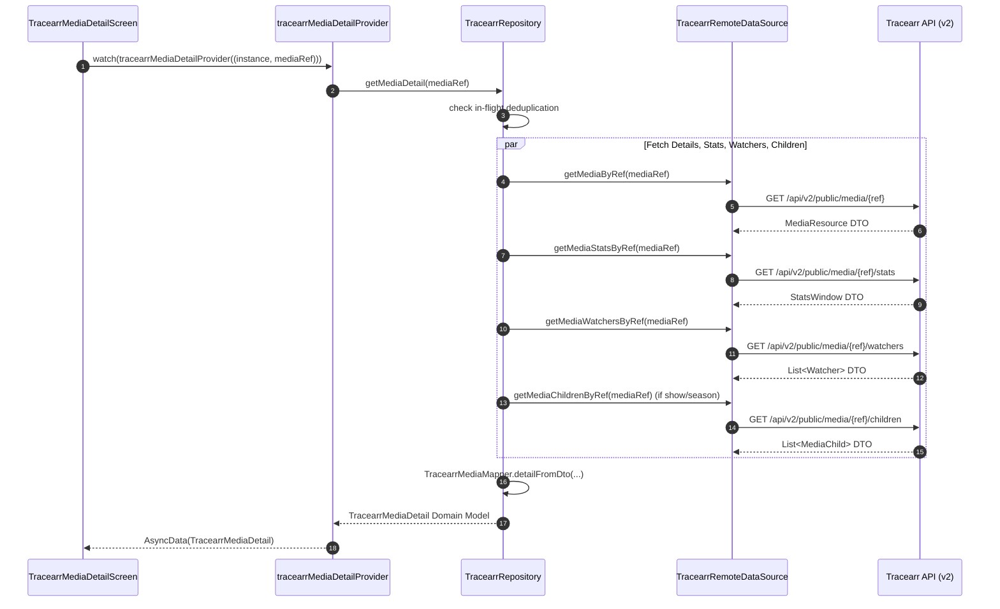

# Architecture Overview (`service_tracearr`)

This document outlines the layered architecture, state lifecycle, and data flow of the `service_tracearr` package.

---

## 1. Architectural Layers

The service is divided into distinct, decoupled architectural layers:

```
[ UI Layer ]
  Screens (TracearrHomeScreen, TracearrMediaDetailScreen, TracearrUserDossierScreen)
  Tabs (OverviewTab, ActivityTab, MediaTab, PeopleTab, SecurityTab)
  Widgets & Feed Components
       │
       ▼ (watches / reads)
[ Provider & State Layer ]
  TracearrProviders (tracearrRecentPaginatedProvider, tracearrMediaDetailProvider, etc.)
  StateNotifiers / AsyncNotifiers (TracearrRecentPaginatedNotifier)
       │
       ▼ (invokes)
[ Repository Layer ]
  TracearrRepository (Deduplication, in-flight request coalescing, mapper orchestration)
       │
       ▼ (delegates to)
[ Data Source Layer ]
  TracearrRemoteDataSource (HTTP orchestration via Dio, OpenAPI SDK integration)
       │
       ▼ (executes)
[ Network & Serialization Layer ]
  Generated OpenAPI v1 & v2 SDKs (RawPublicAPIApi, RawPublicAPIV2Api)
  Dio Client with Auth Interceptors
```

---

## 2. Layer Specifications

### 2.1 UI Layer (`lib/src/media/`, `lib/src/activity/`, `lib/src/overview/`, `lib/src/people/`, `lib/src/security/`)
- **Structure**: Subdivided by functional domain. Each domain contains tabs, screens, and reusable widgets.
- **Rules**:
  - Widgets are purely declarative and consume state via Riverpod `ConsumerWidget` or `ConsumerStatefulWidget`.
  - UI never interacts with `TracearrRemoteDataSource` or Dio directly; all interactions route through providers.
  - Subsections that fetch independent async data (e.g. `MediaDedicatedHistoryFeed`, season episodes in `MediaTvHierarchyView`) manage their own isolated `Consumer` widgets with dedicated loading and error recovery.

### 2.2 Provider Layer (`lib/src/providers/tracearr_providers.dart`)
- **Lifecycle**: Most providers are scoped as `autoDispose.family` keyed on `(Instance, ...)` tuples.
- **Provider Types**:
  - **`FutureProvider.autoDispose.family`**: Read-only single-fetch queries (e.g. `tracearrHealthProvider`, `tracearrMediaDetailProvider`, `tracearrMediaChildrenProvider`).
  - **`StateNotifierProvider.autoDispose.family`**: Dynamic or paginated state machines (e.g. `tracearrRecentPaginatedProvider`).
  - **`StateProvider.family`**: Ephemeral UI state (e.g. `tracearrActiveTabProvider`, `tracearrLibraryFilterProvider`).

### 2.3 Repository Layer (`lib/src/repository/tracearr_repository.dart`)
- **Purpose**: The sole coordinator of business logic, DTO mapping, and in-flight request deduplication.
- **Deduplication Mechanism**: Uses an internal `_deduplicate(key, task)` cache map to coalesce concurrent identical queries into a single future, preventing redundant backend load during concurrent UI rendering.
- **Artwork Resolution**: Prioritizes `grandparentRatingKey` for TV episodes to resolve the 2:3 vertical series poster across Plex, Jellyfin, and Emby servers.

### 2.4 Data Source Layer (`lib/src/datasources/tracearr_remote_data_source.dart`)
- **Purpose**: Translates repository requests into typed calls against generated OpenAPI SDKs (`RawPublicAPIApi` for v1 and `RawPublicAPIV2Api` for v2).
- **Transport**: Utilizes Atrium's centralized `Dio` client, configured with Bearer token authentication headers (`Authorization: Bearer <token>`) and SSL verification. Authentication tokens and base URLs are injected from Atrium core's `Instance` model.

### 2.5 Mapping Layer (`lib/src/mappers/`)
- **Purpose**: Converts generated, raw DTOs into clean, immutable Dart domain models (`lib/src/models/tracearr_models.dart`).
- **Responsibilities**:
  - Normalizes nulls and string-encoded integers.
  - Generates proxy artwork URLs via `TracearrMediaUrlResolver`.
  - Decouples UI code from upstream API schema changes.

---

## 3. Data Flow Example: Media Detail Loading


