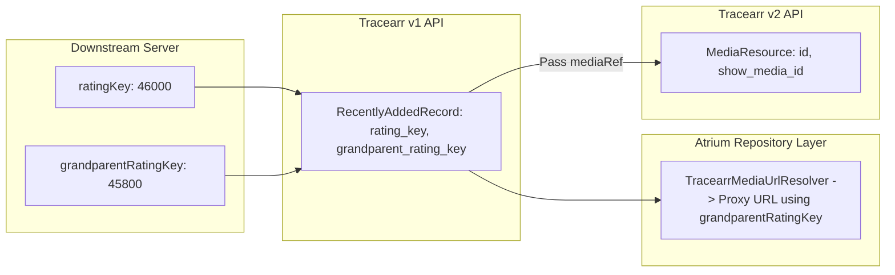

# Identifier Reference & Scopes (`service_tracearr/docs/integration`)

This document catalogs every identifier type utilized in `service_tracearr`, its origin, scope, and validation rules.

---

## 1. Identifier Catalog

| Identifier Name | Typical Format | Originating Layer | Scope & Usage |
| :--- | :--- | :--- | :--- |
| **`mediaRef`** | UUID or integer string | Parameter passed to detail screens | Generic reference accepted by `/api/v2/public/media/{ref}`. Can be either a canonical v2 UUID or a downstream server rating key. |
| **`ratingKey`** | Numeric string (e.g. `"46000"`) | Downstream media server (Plex/Jellyfin/Emby via v1 API) | Unique within a single downstream media server instance. Used to construct Plex deep links and server image proxy URLs. |
| **`grandparentRatingKey`**| Numeric string (e.g. `"45800"`) | Downstream media server (v1 API) | Identifies the parent TV Show of an episode. Used by `TracearrRepository` to resolve 2:3 vertical series posters for episode cards. |
| **`parentRatingKey`** | Numeric string (e.g. `"45900"`) | Downstream media server (v1 API) | Identifies the parent Season of an episode. |
| **`showMediaId`** | UUID string (e.g. `"show_succ_1"`) | Tracearr v2 API | Canonical UUID of the parent TV series. Used by `TracearrMediaDetailScreen` to navigate Episode $\rightarrow$ Series. |
| **`serverId`** | UUID or machine ID string | Downstream media server registration in Tracearr | Identifies which physical media server holds a copy of the file. Used to scope health status, live streams, and proxy URLs. |
| **`userId`** | UUID or username string | Tracearr v2 User Directory | Identifies a registered user in Tracearr. Used by `TracearrUserDossierScreen`. |
| **`libraryId`** | Integer / string ID | Downstream media server library | Identifies a specific library (e.g. Movies library). Used to filter the Recently Added feed. |

---

## 2. Identifier Scope & Transformation Flow

