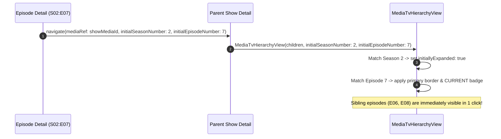

# Media Navigation & Contextual Handshake (`service_tracearr/docs/media`)

This document details the TV series navigation flow, contextual parameters, and active episode highlighting in the Media subsystem.

---

## 1. Episode $\rightarrow$ Series Navigation Context

When a user opens an individual episode (e.g. `Succession S02:E07`) and taps the **`Series`** ActionChip, the client executes a contextual handshake:

---

## 2. Navigation State Rules

1. **Normal Show Navigation**: When navigating to a Show directly (e.g. from Recently Added Show card or Overview/Activity Show card), `initialSeasonNumber` and `initialEpisodeNumber` are `null`. All seasons render collapsed by default without arbitrary auto-expansion or false highlights.
2. **Episode Context Propagation**:
   - `RecentlyAddedPosterTile` / `RecentlyAddedCard` passes `item.seasonNumber` and `item.episodeNumber` into `TracearrMediaDetailScreen.navigate()`.
   - On the Episode detail screen, tapping `Series` forwards `initialSeasonNumber` and `initialEpisodeNumber` to the parent show.
   - In `MediaTvHierarchyView`, the season matching `initialSeasonNumber` sets `initiallyExpanded: true`.
   - Inside the expanded season, the episode matching `initialEpisodeNumber` renders a distinct `CURRENT` badge and primary background tint.
3. **Sibling Episode Tap**: Tapping any sibling episode inside `MediaTvHierarchyView` pushes `TracearrMediaDetailScreen` for that episode, carrying the new episode number.
