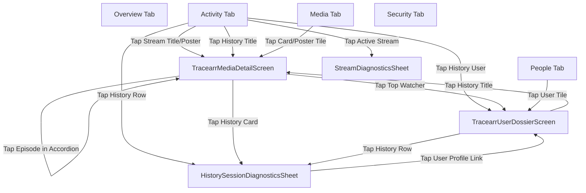

# Navigation & Routing Reference (`service_tracearr`)

This document maps all navigation entry points, destinations, route parameters, and contextual transitions in `service_tracearr`.

---

## 1. Top-Level Tab Destinations

`TracearrHomeScreen` serves as the primary service dashboard, hosting 5 destinations managed by `tracearrActiveTabProvider`:

```
TracearrHomeScreen (IndexedStack / NavigationBar)
├── [0] OverviewTab  - Fleet health, active stream distribution, 24h summary tiles, 7-day trend.
├── [1] ActivityTab  - Real-time active streams feed and chronological playback history.
├── [2] MediaTab     - Fleet storage summary bar, library filter chips, Recently Added catalog.
├── [3] PeopleTab    - Registered users directory with lifetime watch hours and play metrics.
└── [4] SecurityTab  - Concurrent stream violations and security incident triage.
```

---

## 2. Global Navigation Map



---

## 3. Detailed Route Contracts

### 3.1 `TracearrMediaDetailScreen.navigate`
- **Location**: `lib/src/media/screens/tracearr_media_detail_screen.dart`
- **Entry Points**:
  - `RecentlyAddedPosterTile` / `RecentlyAddedCard` (Media Tab)
  - `ActiveStreamCard` (Activity / Overview Tab)
  - `HistoryItemCard` (Activity Tab / User Dossier / Dedicated History)
  - `MediaTvHierarchyView` (Show / Season detail)
- **Parameters**:
  - `required Instance instance`: The active server instance.
  - `required String mediaRef`: The canonical media UUID or server rating key.
  - `String? initialTitle`: Instant title for the app bar while loading.
  - `String? initialPosterUrl`: Instant poster backdrop while loading.
  - `int? initialSeasonNumber`: Target season number to auto-expand in `MediaTvHierarchyView`.
  - `int? initialEpisodeNumber`: Originating episode number to highlight with `CURRENT` badge.

### 3.2 `TracearrUserDossierScreen.navigate`
- **Location**: `lib/src/people/screens/tracearr_user_dossier_screen.dart`
- **Entry Points**:
  - User row tap in `PeopleTab`
  - Top watcher tap in `MediaWatchersLeaderboard`
  - User avatar tap in `HistoryItemCard` or `HistorySessionDiagnosticsSheet`
- **Parameters**:
  - `required Instance instance`: Active server instance.
  - `required String userId`: Canonical user UUID or username.
  - `String? username`: Display username.
  - `String? initialAvatarUrl`: Avatar image URL.

### 3.3 `HistorySessionDiagnosticsSheet.show`
- **Location**: `lib/src/activity/widgets/history_session_diagnostics_sheet.dart`
- **Entry Points**: Tapping any `HistoryItemCard` across Activity Tab, Media Dedicated History, or User Dossier.
- **Parameters**:
  - `required Instance instance`: Active server instance.
  - `required TracearrHistoryItem item`: Historical playback session record.
