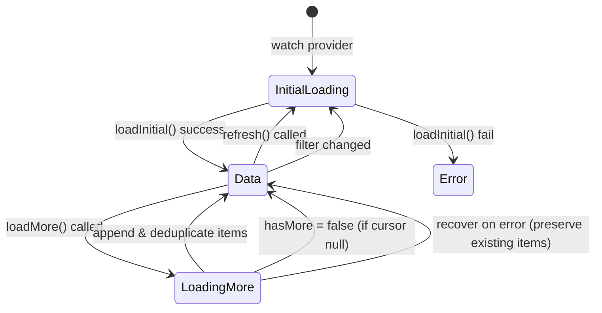

# Riverpod Provider Architecture (`service_tracearr`)

This document catalogs all Riverpod providers and state notifiers defined in `lib/src/providers/tracearr_providers.dart`.

---

## 1. Provider Design Patterns

`service_tracearr` follows these standard Riverpod patterns:
- **Family Scoping**: Every backend provider is scoped as a `.family` taking `Instance` (or a tuple `(Instance, ...)`), ensuring state is fully isolated per server instance.
- **Automatic Resource Cleanup**: Read-only query providers use `.autoDispose` to reclaim memory when the user navigates away from the screen.
- **State Machine Notifiers**: Complex feeds (e.g. Recently Added media) use `StateNotifierProvider` to manage pagination cursors, loading locks, and incremental deduplication.

---

## 2. Provider Catalog

### 2.1 Core Infrastructure Providers

| Provider | Type | Inputs | Purpose |
| :--- | :--- | :--- | :--- |
| `tracearrRemoteDataSourceProvider` | `Provider.family` | `Instance` | Instantiates `TracearrRemoteDataSource` with active API key and base URL. |
| `tracearrRepositoryProvider` | `FutureProvider.family` | `Instance` | Resolves the initialized `TracearrRepository` singleton for the instance. |
| `tracearrActiveTabProvider` | `StateProvider.family` | `Instance` | Tracks the active tab index on `TracearrHomeScreen` (0: Overview, 1: Activity, 2: Media, 3: People, 4: Security). |

---

### 2.2 Overview & Fleet Pulse Providers

| Provider | Type | Inputs | Source Data / Function |
| :--- | :--- | :--- | :--- |
| `tracearrHealthProvider` | `FutureProvider.autoDispose.family` | `Instance` | Queries `/api/v1/health` for online servers, versions, and active streams. |
| `tracearrStatsTodayProvider` | `FutureProvider.autoDispose.family` | `(Instance, String? serverId, String? timezone)` | Queries `/api/v1/stats/today` for 24h play counts, watch hours, and alerts. |
| `tracearrStatsTodayComputedProvider`| `FutureProvider.autoDispose.family` | `Instance` | Derives fleet-wide 24h metrics across all connected servers. |
| `tracearrActivityTrendsProvider` | `FutureProvider.autoDispose.family` | `(Instance, String? period, String? serverId, String? timezone)` | Queries `/api/v1/activity` for 7-day activity histogram data. |
| `tracearrStatsProvider` | `FutureProvider.autoDispose.family` | `(Instance, String? serverId)` | Queries `/api/v1/stats` for 30-day aggregate watch duration. |

---

### 2.3 Activity & Live Streams Providers

| Provider | Type | Inputs | Source Data / Function |
| :--- | :--- | :--- | :--- |
| `tracearrActiveStreamsProvider` | `FutureProvider.autoDispose.family` | `(Instance, String? serverId)` | Fetches live playback sessions and transcode states via `/api/v1/activity`. |
| `tracearrHistoryProvider` | `FutureProvider.autoDispose.family` | `(Instance, String? serverId)` | Queries `/api/v2/public/history` for fleet-wide chronological history. |

---

### 2.4 Media Intelligence Providers

| Provider | Type | Inputs | Source Data / Function |
| :--- | :--- | :--- | :--- |
| `tracearrLibrariesProvider` | `FutureProvider.autoDispose.family` | `Instance` | Queries `/api/v1/libraries` for library rollups and counts. |
| `tracearrLibraryFilterProvider` | `StateProvider.family` | `Instance` | Holds the currently selected library filter (`null` = all libraries). |
| `tracearrRecentPaginatedProvider`| `StateNotifierProvider.autoDispose.family` | `Instance` | Manages cursor-based pagination state for recently added media. |
| `tracearrMediaDetailProvider` | `FutureProvider.autoDispose.family` | `(Instance, String mediaRef)` | Queries `/api/v2/public/media/{ref}` aggregated with stats and watchers. |
| `tracearrMediaChildrenProvider` | `FutureProvider.autoDispose.family` | `(Instance, String mediaRef)` | Queries `/api/v2/public/media/{ref}/children` for on-demand season episodes. |
| `tracearrMediaHistoryProvider` | `FutureProvider.autoDispose.family` | `(Instance, String mediaRef)` | Queries `/api/v2/public/media/{ref}/history` for dedicated title watch sessions. |

---

### 2.5 User Directory & Dossier Providers

| Provider | Type | Inputs | Source Data / Function |
| :--- | :--- | :--- | :--- |
| `tracearrUsersProvider` | `FutureProvider.autoDispose.family` | `Instance` | Fetches all user identities with concurrent stats rollups via `/api/v2/public/users`. |
| `tracearrUserDetailProvider` | `FutureProvider.autoDispose.family` | `(Instance, String userId)` | Fetches user identity, stats, and watch history for a single user dossier. |

---

### 2.6 Security & Incident Providers

| Provider | Type | Inputs | Source Data / Function |
| :--- | :--- | :--- | :--- |
| `tracearrViolationsProvider` | `FutureProvider.autoDispose.family` | `(Instance, String? serverId)` | Queries `/api/v1/security/violations` for concurrent stream incidents. |

---

## 3. Paginated State Machine (`TracearrRecentPaginatedNotifier`)

### Key Safety Invariants:
1. **Concurrency Lock**: `loadMore()` immediately returns if `state.isLoadingMore == true` or `state.isLoadingInitial == true`.
2. **End-of-List Protection**: Returns if `state.hasMore == false` or `state.nextCursor == null`.
3. **Deduplication**: Filters incoming items using `item.id` against existing loaded items.
